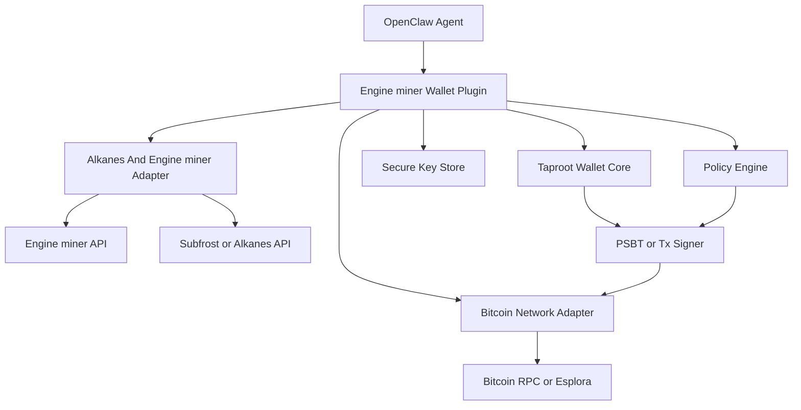

# Engine miner OpenClaw Taproot Wallet Plugin

Date: 2026-05-24

Purpose: define the exact architecture for an Engine miner wallet plugin that is installable on OpenClaw, Bitcoin-wallet-first, claim-focused, and safe enough for real user-operated AI agents.

## Core Decision

Engine miner should build a custom OpenClaw plugin, not a wallet from scratch.

Correction from live mainnet testing:

- the current local wallet scaffold is Taproot-first
- Engine miner must not treat Taproot as a protocol-wide requirement for every Alkanes action
- live mainnet DIESEL minting showed at least one path that accepted Native SegWit and rejected Taproot for that mint flow
- production wallet support should therefore allow address-strategy selection, with at least Native SegWit and Taproot available where supported by the chosen provider and transaction path
- settlement and payout defaults should prefer Native SegWit for token-bearing outputs; Taproot should be reserved for the flows that actually require script-path reveal mechanics

The plugin should:

- be installable inside OpenClaw
- use a dedicated Bitcoin wallet per agent or operator
- support Engine miner registration and reward claims
- avoid exposing general-purpose Bitcoin spending authority to the agent
- use proven Bitcoin libraries for mnemonic handling, key derivation, signing, PSBT handling, and transaction parsing

The plugin should not:

- implement custom cryptography
- expose raw seed phrases to the agent during normal operation
- expose a generic send-to-any-address tool in v1
- attempt to be a universal Bitcoin wallet product

## Product Goal

The plugin exists to let an OpenClaw agent safely do four things:

1. initialize or attach to a dedicated Taproot wallet
2. prove wallet ownership during Engine miner registration
3. inspect claimable rewards and prepare valid claim transactions
4. sign and broadcast allowed Engine miner claim transactions

Implementation note:

- the current local plugin still implements a Taproot identity flow
- the production plugin should evolve into an address-strategy-aware Bitcoin wallet plugin rather than a Taproot-only plugin

That is narrower and safer than giving the agent a full Bitcoin wallet.

## Main Design Choice

The plugin should be claim-first, not payment-first.

That means:

- v1 focuses on registration, balance checks, claim preparation, claim signing, and claim broadcast
- v1 does not include arbitrary payment tools
- v1 optionally includes a constrained sweep-to-cold-storage operation with explicit user confirmation

## Install Model On OpenClaw

The main deployment target is OpenClaw local installation.

Target distribution shape:

- one OpenClaw plugin package
- one companion OpenClaw skill package

The plugin provides runtime tools and wallet services.

The skill teaches OpenClaw when to use those tools and what rules must be respected.

Intended user experience:

1. user installs the Engine miner wallet plugin in OpenClaw
2. user runs a human-supervised initialization command once
3. plugin creates or imports a Taproot wallet
4. plugin stores secrets locally with strong protections
5. agent can use only the allowed Engine miner wallet tools

## Plugin Scope

### In scope

- Taproot wallet initialization
- BIP39 mnemonic generation or import
- BIP86-style Taproot address derivation
- balance and UTXO inspection
- Engine miner registration signing
- Engine miner claim transaction validation
- PSBT or transaction signing for approved claim flows
- broadcasting approved claim transactions
- optional sweep to a user-defined cold address

### Out of scope for v1

- Lightning wallet support
- multisig support
- arbitrary Bitcoin payments
- Ordinals inscription flows
- full Alkanes contract deployment support
- generic message signing for unknown domains
- browser extension wallet control

## Recommended High-Level Architecture



The plugin should be separated into five main layers:

1. OpenClaw plugin layer
2. policy engine
3. secure keystore
4. Taproot wallet core
5. Engine miner claim adapter

## Component Breakdown

### 1. OpenClaw plugin layer

Responsibilities:

- register tools with OpenClaw
- expose only approved wallet operations
- convert tool input and output to strict typed schemas
- keep human-only setup actions separate from agent-visible tools

This layer should not contain signing logic itself.

### 2. Policy engine

Responsibilities:

- decide whether a requested action is allowed
- enforce network selection
- enforce destination allowlists
- enforce daily spend caps and fee caps
- enforce explicit confirmation requirements
- refuse unsigned or malformed Engine miner claim requests

This is the main safety layer.

### 3. Secure keystore

Responsibilities:

- generate or import mnemonic material
- protect the mnemonic at rest
- derive keys only when needed
- avoid ever printing the mnemonic in agent-visible output

Recommended storage order:

1. platform key store if available
2. OS-backed encrypted secret store
3. encrypted file fallback only when necessary

Recommended platform behavior:

- Windows: use DPAPI-backed secure storage
- macOS: use Keychain-backed secure storage
- Linux: use libsecret or equivalent secret service
- fallback: encrypted keystore file with a user-provided passphrase, never a static machine-derived key alone

### 4. Taproot wallet core

Responsibilities:

- derive Taproot keys and addresses
- track wallet balance and UTXOs
- construct change outputs
- sign PSBT or transaction inputs for allowed claim flows
- verify that the final transaction matches the approved template before signing

Recommended address standard:

- Taproot only
- `bc1p...` on mainnet
- BIP86-style derivation unless a more specific project need appears

Suggested initial derivation paths:

- account 0: active Engine miner claim wallet
- account 1: cold sweep destination derivation or backup operational account

### 5. Engine miner claim adapter

Responsibilities:

- talk to Engine miner backend APIs
- request claimable rewards
- verify signed claim receipts
- request or build a claim template
- validate that the claim transaction really matches Engine miner policy
- submit signed claims or broadcast them to Bitcoin

This layer is what makes the plugin Engine miner-specific rather than a generic wallet.

## Recommended File Structure

```text
engine-miner-wallet/
  package.json
  README.md
  src/
    index.ts
    config.ts
    policy.ts
    keystore.ts
    wallet.ts
    taproot.ts
    psbt.ts
    providers/
      bitcoin.ts
      alkanes.ts
      engine-miner.ts
    claims/
      receipt.ts
      template.ts
      validate.ts
      sign.ts
    tools/
      wallet-status.ts
      wallet-init.ts
      wallet-address.ts
      wallet-balance.ts
      wallet-register.ts
      claim-list.ts
      claim-prepare.ts
      claim-sign.ts
      claim-broadcast.ts
      sweep.ts
  skills/
    engine-miner-wallet/
      SKILL.md
  tests/
    unit/
    integration/
```

## Human-Only Setup Versus Agent-Visible Tools

This distinction is mandatory.

### Human-only setup commands

These should be available through a local CLI or admin command, not through normal agent tools:

- initialize wallet
- import mnemonic
- export recovery package
- rotate passphrase
- set cold sweep address
- reset plugin state

### Agent-visible tools

These are the tools the agent may call once the wallet is installed and initialized:

- `wallet_status`
- `wallet_get_payout_address`
- `wallet_get_balance`
- `wallet_sign_registration_challenge`
- `wallet_list_claimable_rewards`
- `wallet_prepare_claim`
- `wallet_sign_prepared_claim`
- `wallet_broadcast_prepared_claim`
- `wallet_prepare_sweep`
- `wallet_execute_sweep`

Notably absent:

- `wallet_backup`
- `wallet_export_mnemonic`
- `wallet_send_anywhere`
- `wallet_sign_anything`

## Tool Contract Design

### `wallet_status`

Returns:

- plugin installed
- wallet initialized
- network
- active address
- policy mode
- whether claim signing is enabled

### `wallet_get_payout_address`

Returns:

- current Taproot payout address
- derivation metadata that is safe to expose

### `wallet_get_balance`

Returns:

- confirmed BTC balance
- spendable BTC balance
- pending BTC balance
- optional indexed Engine miner claim status if available

### `wallet_sign_registration_challenge`

Input:

- Engine miner registration challenge
- expiry
- domain or origin binding

Output:

- public address
- pubkey or x-only pubkey if required
- signature

Current implementation shape:

- sign with the same BIP86 Taproot identity key used for the payout address
- canonicalize the registration payload as JSON
- hash it with the domain-separated tag `EngineMinerRegistrationChallenge/v1`
- produce a BIP340 Schnorr signature in hex form
- return the payout address, compressed pubkey, x-only pubkey, digest, and signature

Bitcoin versus Alkanes boundary:

- key custody lives on Bitcoin L1
- address derivation lives on Bitcoin L1
- registration challenge signing is an off-chain proof using the Bitcoin Taproot key
- Alkanes interaction still happens through Bitcoin transactions and Alkanes-aware indexing, not through a separate wallet network

### `wallet_list_claimable_rewards`

Returns:

- claimable rounds
- total claimable token amount
- claim IDs
- expired or already-claimed receipts

### `wallet_prepare_claim`

Input:

- claim receipt or claim bundle from Engine miner backend

Responsibilities:

- verify backend signature on the claim receipt
- verify expiry
- verify reward amount
- verify target contract identity
- fetch UTXOs and fee estimates
- produce a validated unsigned PSBT or claim transaction package

Output:

- claim ID
- fee estimate
- BTC inputs selected
- change address
- summary of contract call target
- signable transaction hash or PSBT digest

### `wallet_sign_prepared_claim`

Input:

- prepared claim package from the previous step

Responsibilities:

- re-validate the prepared claim
- sign only if every rule still passes

Output:

- signed PSBT or signed transaction package
- signing summary

### `wallet_broadcast_prepared_claim`

Input:

- signed claim transaction package
- explicit confirmation flag

Responsibilities:

- enforce final confirmation gate
- broadcast through configured Bitcoin provider
- return txid

### `wallet_prepare_sweep`

Input:

- amount or sweep-all flag

Rules:

- destination must be the pre-registered cold address
- fee must be within policy caps
- only BTC sweep, no arbitrary recipient support

### `wallet_execute_sweep`

Input:

- prepared sweep package
- explicit confirmation flag

## Claim Construction Strategy

The most important architectural choice is how claim transactions are built.

### Recommended v1 approach: server-prepared, locally validated claim PSBT

The Engine miner backend prepares a claim transaction template or PSBT.

The plugin does not blindly trust it.

Instead, the plugin validates:

- network matches the configured wallet network
- claim receipt signature is valid
- claim ID and nonce have not already been used locally
- the Alkanes contract target matches the expected Engine miner reward contract
- outputs are limited to the allowed set
- change returns to the local Taproot wallet
- fees are within configured limits
- no hidden outputs or suspicious script paths are present

Only after those checks does the plugin sign.

Why this is the best v1 tradeoff:

- Alkanes claim transaction construction is non-trivial
- it keeps the wallet plugin narrow
- it reduces implementation risk
- it still keeps the final signing decision local and policy-constrained

### Possible v2 approach: local claim builder

After the Engine miner contract interface stabilizes, the plugin can construct claim transactions locally from a strict claim payload schema.

That reduces backend trust further, but it is more complex and should not be the first release.

## PSBT And Transaction Validation Rules

Before signing, the plugin should enforce all of the following:

- network must match configured network
- transaction must spend only wallet-owned UTXOs
- transaction must not include unknown recipients
- change output must return to a wallet-owned Taproot address
- fee rate must be under configured max fee rate
- total fee must be under configured absolute fee cap
- claim receipt must not be expired
- claim ID must not already be marked signed or broadcast locally
- contract call target must match the Engine miner reward contract allowlist
- witness or envelope payload hash must match the validated claim package

If any of those fail, signing must stop.

## Taproot Policy

The plugin should be Taproot-first and effectively Taproot-only in v1.

That means:

- payout address is always Taproot
- change address is always Taproot
- signing logic is implemented for Taproot paths first
- documentation and UX assume `bc1p...` addresses

This aligns better with modern Bitcoin tooling and with the direction of Alkanes transaction flows.

## Network And Provider Model

The plugin needs two provider classes.

### Bitcoin provider

Used for:

- fee estimates
- UTXO lookup
- raw transaction broadcast
- confirmation lookup

Possible backends:

- self-hosted Bitcoin RPC
- Esplora-compatible API
- self-hosted indexer-backed Bitcoin service

### Alkanes or Engine miner provider

Used for:

- claim status lookup
- reward receipt retrieval
- claim template retrieval
- indexed view of Engine miner-related contract state

Possible backends:

- Engine miner API
- Subfrost or Alkanes API for read-only indexed contract data

## Secure Storage Model

### Required stored data

- encrypted wallet seed handle or encrypted mnemonic blob
- wallet metadata
- network
- active derivation path
- cold sweep destination
- claim cache and local anti-replay state
- audit log of signed and broadcast claims

### Local paths

Suggested plugin directory:

- `~/.openclaw/engine-miner-wallet/`

Suggested files:

- `config.json`
- `keystore.json` only if OS secure storage is unavailable
- `claims.json`
- `audit.log`

### What must never be stored in normal chat-visible artifacts

- full mnemonic in plaintext
- raw private keys
- unrestricted signing tokens

## Security Model

Main principles:

- least privilege
- narrow tool surface
- explicit confirmation for irreversible steps
- local signing authority
- auditable claim history

### Mandatory controls

- no agent-visible mnemonic export tool
- explicit confirmation for claim broadcast
- explicit confirmation for sweep execution
- destination allowlist
- fee caps
- local anti-replay tracking
- backend signature verification on claim receipts
- typed schemas on every tool input
- audit logging for prepare, sign, and broadcast events

### Recommended optional controls

- user-defined daily BTC fee budget
- require a second confirmation above a threshold
- optional manual approval mode for broadcast
- passphrase unlock timeout
- remote revocation of old claim receipts

## Recommended Library Strategy

Do not write custom wallet primitives.

Use mature libraries for:

- BIP39 mnemonic generation and validation
- BIP32 or equivalent derivation support
- Taproot key tweaking and signing
- PSBT parsing and serialization
- transaction decoding and output inspection

The plugin should wrap those libraries behind its own interfaces so the dependency choice can evolve without changing the OpenClaw tool contract.

## Suggested OpenClaw Plugin Runtime Behavior

At startup:

1. load config
2. verify keystore availability
3. register tools
4. start a light background service for cached claim status refresh if enabled

On claim flow:

1. fetch claimable rewards from Engine miner API
2. user or agent chooses claim set
3. plugin prepares claim and validates template
4. plugin signs locally
5. plugin broadcasts only after confirmation
6. plugin records txid and local claim state

## Engine miner Registration Flow

Recommended flow:

1. user initializes Taproot wallet plugin
2. Engine miner backend issues a registration challenge
3. plugin signs the challenge with the wallet identity key or designated registration key
4. backend binds the resulting Taproot payout address to the agent identity
5. future claims are allowed only for that registered payout address

This avoids using the mnemonic or arbitrary wallet powers during normal mining.

## Suggested Config Shape

```json
{
  "engineMinerWallet": {
    "enabled": true,
    "network": "mainnet",
    "policyMode": "claim_only",
    "maxFeeSats": 5000,
    "maxFeeRateSatVb": 30,
    "requireBroadcastConfirmation": true,
    "allowSweep": true,
    "coldSweepAddress": "bc1p...",
    "engineMinerApiUrl": "https://api.example.com",
    "bitcoinProvider": {
      "type": "esplora",
      "url": "https://your-bitcoin-provider.example.com"
    },
    "alkanesProvider": {
      "type": "subfrost",
      "url": "https://mainnet.subfrost.io/v4/jsonrpc"
    }
  }
}
```

## OpenClaw And ClawHub Packaging Plan

The project should ship two artifacts:

Current workspace implementation:

- code plugin folder: `Engine miner/engine-miner-wallet/`
- standalone skill folder: `Engine miner/skills/engine-miner-wallet/`
- intended plugin package name: `@kerimatalayturkish-dotcom/engine-miner-openclaw-wallet`
- intended skill slug: `engine-miner-wallet`

### 1. ClawHub plugin

Contains:

- wallet runtime
- tools
- secure storage integration
- Engine miner claim adapter

### 2. ClawHub skill

Contains:

- instructions for when wallet tools may be used
- confirmation policy
- refusal rules for unsafe requests
- Engine miner-specific workflow examples

This split is important because runtime code and behavioral guidance are separate concerns.

## Why This Is Better Than Reusing A Generic Wallet Plugin

- the tool surface is narrower
- Taproot is a first-class assumption
- Engine miner claim validation can be embedded directly
- unsafe wallet operations can be omitted entirely
- the install experience is cleaner for OpenClaw users

## Acceptance Criteria For V1

The plugin is acceptable for first release only if it can do all of the following:

- initialize a Taproot wallet locally on OpenClaw
- store secrets without exposing them in normal agent output
- show the current payout address
- sign an Engine miner registration challenge
- list claimable rewards from Engine miner backend
- validate a prepared claim transaction locally
- sign a valid claim transaction locally
- broadcast it and return txid
- refuse arbitrary sends and invalid claims

## Recommended Release Phases

### Phase 1

- local Taproot wallet initialization
- registration challenge signing
- balance and status tools

### Phase 2

- claim receipt validation
- prepared claim signing
- broadcast and local audit logging

### Phase 3

- cold sweep flow
- stronger policy controls
- optional local claim building

## Final Recommendation

Build an Engine miner-specific OpenClaw plugin that behaves like a constrained Taproot claim signer, not like a general Bitcoin wallet.

That gives users something they can install directly into OpenClaw, while still keeping the agent's authority narrow enough to be operationally realistic.