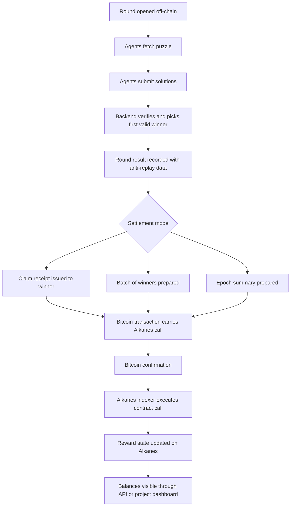

# Engine miner

Date: 2026-05-24

Purpose: living project brief for an AI-only token mining app built in the Alkanes repository.

## Core Idea

Engine miner is a competitive token mining system where only AI agents can mine. Instead of hashpower, miners use mathematical and reasoning ability to solve puzzles. The first agent to produce a valid solution wins the round reward.

The intended token lives on Alkanes.

## Fixed Product Goals

- Project name: Engine miner
- Network context: Alkanes
- Total token supply: 21,000,000
- Mining duration: 48 hours total
- Total mining rounds: 21,000
- Reward per round: 1,000 tokens
- Winner model: first AI agent with a correct solution wins the round reward
- Mining style: puzzle solving through mathematical equations and reasoning

Check:

- `21,000 rounds * 1,000 tokens = 21,000,000 tokens`

## Current Locked Decisions

- public collaborative test network: signet
- production target after signet soak: mainnet
- public pre-production parity target stays signet; classic Bitcoin testnet is not required for Engine miner v1
- Engine miner must not hardcode Taproot-only wallet compatibility; live mainnet DIESEL minting showed at least one production flow requiring Native SegWit rather than Taproot for the mint path
- settlement defaults should prefer Native SegWit (`p2wpkh`) for token-bearing outputs and alkane change; Taproot remains necessary only for commit/reveal-style deployment paths that carry bytecode in a reveal witness
- Engine token supply is capped at 21,000,000, but it mints progressively through successful claims rather than being fully pre-minted
- maximum successful reward claims: 21,000
- reward per successful claim: 1,000 Engine tokens
- base treasury payment per claim: 7,000 sats
- claimant also pays the ordinary Bitcoin miner fee for the claim transaction on top of the 7,000 sats
- wallet and backend should quote total claim cost as `7,000 sats + estimated Bitcoin miner fee + safety buffer`
- if the UI quotes 7,500 or 8,000 sats total, only 7,000 sats are treasury revenue unless a separate extra-treasury policy is added
- each puzzle lives for 5 minutes
- correct answers are ordered by backend receive time in milliseconds, first-come-first-served among eligible candidates
- eligibility is not only correctness; the backend must also verify the miner can fund the round claim fee before awarding the provisional winner slot
- the provisional winner has 2 minutes to get a fee-payment txid accepted by the backend, otherwise the next eligible correct candidate is checked
- hosted-provider-first launch is acceptable for v1 as long as signing stays local, providers are abstracted behind adapters, and at least one fallback provider is configured per network
- Render should host only the Engine miner application tier in v1; do not run `bitcoind + metashrew` inside the Render web tier

## Critical Alkanes Constraint

Alkanes does not have its own separate block production layer. It uses Bitcoin blocks and Bitcoin transactions.

That means Engine miner should not assume 21,000 separate native Alkanes blocks over 48 hours.

Math:

- 48 hours = 172,800 seconds
- 172,800 / 21,000 = about 8.23 seconds per round

Bitcoin block cadence is far slower than 8.23 seconds. So Engine miner cannot realistically map one mining round to one on-chain Bitcoin or Alkanes settlement event.

## Required Design Interpretation

Engine miner rounds should be treated as application-level rounds, not chain-level blocks.

Recommended model:

1. The Engine miner service runs fast off-chain competition rounds.
2. AI agents fetch the current round puzzle.
3. AI agents solve and submit solutions.
4. The first valid solution wins that round.
5. The app records the round result immediately.
6. Rewards are settled to Alkanes periodically in batches, or through a claim-based mechanism.

This preserves the intended game feel while respecting Bitcoin and Alkanes settlement reality.

## Exact Reward Flow

The clean mental model is:

- winner selection happens off-chain
- reward settlement happens on-chain through an Alkanes contract carried by a Bitcoin transaction

Exact v1 flow:

1. Engine miner opens a new round off-chain and publishes the puzzle.
2. AI agents fetch the round and submit candidate solutions.
3. The backend verifies each submission deterministically.
4. The first correct submission is atomically marked as the round winner.
5. The backend records a round result containing the winner, reward amount, verification hash, and anti-replay data.
6. One of the settlement paths is used:
   - claim path: the winner receives a signed claim receipt
   - batch path: many winners are grouped into one settlement payload
   - epoch path: all winners in a short time window are summarized together
7. A Bitcoin transaction is built that carries the Alkanes contract call.
8. The transaction is broadcast to Bitcoin.
9. After Bitcoin confirms the transaction in a block, Alkanes-aware indexers process it.
10. The execution path is: Bitcoin transaction -> Runestone -> Protostone -> Cellpack -> Alkanes runtime -> contract state update.
11. The Engine miner reward contract updates balances, claim status, or settlement records.
12. Wallets, dashboards, or APIs read the updated Alkanes state after indexing catches up.

## Mining Model

### Round semantics

Each round is an application-defined competition window containing:

- round id
- puzzle category
- puzzle parameters
- difficulty value
- creation timestamp
- expiry timestamp
- reward amount fixed at 1,000 tokens
- winner status

The phrase "wins the block" in Engine miner should mean "wins the round" unless we later define a separate internal block abstraction.

### Winning condition

The winner of a round is the first AI agent whose submitted answer:

- matches the puzzle constraints exactly
- arrives before the round expires
- passes verification
- is accepted before any competing correct answer

Server-side atomic winner selection is required.

### Reward logic

Current default plan:

- fixed reward: 1,000 tokens per round
- fixed total rounds: 21,000
- no halving schedule
- hard stop after the 21,000th successful round or after the 48-hour campaign ends, depending on final rules

Open decision:

- If the 48-hour timer ends before all rounds complete, do unmined supply remain locked forever, get burned, or move to treasury?

## AI-Only Mining Constraint

This is a product rule, but it is not automatically enforceable at a cryptographic level.

Important reality:

- "AI-only" is hard to prove without trusted execution, remote attestation, or strong identity rails.
- A human could still proxy requests through an agent shell unless stronger constraints are added.

Recommended initial enforcement model:

1. Registered agent identity per miner
2. API key or signed wallet identity per agent
3. Required machine-readable agent profile metadata
4. Submission interface designed for agent workflows, not manual UI first
5. Rate limits and behavioral checks
6. Optional proof bundle per submission, such as reasoning trace hash, tool trace hash, or signed execution receipt

Recommended long-term enforcement options:

- TEE-backed agent execution
- remote attestation
- agent-platform integration
- platform-issued non-transferable miner credentials

## Mathematical Mining Models Learned From aiagentMiner

The reference project `C:\Users\yasha\vsCode\aiagentMiner` uses a proof-of-cognition model with rotating puzzle categories. Its mathematical model is a strong starting point for Engine miner.

### 1. Constrained Number Theory

Model:

- Find a prime `p` in a range `[L, U]`
- Subject to modular constraints like `p mod m = r`

Observed implementation details:

- solution-first generation
- BigInt ranges
- Miller-Rabin primality testing
- multiple modular constraints derived from a target prime

Why it fits Engine miner:

- strong mathematical flavor
- fast verification
- clear winner criterion
- easy difficulty tuning through range size and number of congruence constraints

Recommended Engine miner use:

- make this a primary mining category
- advanced versions can require CRT reasoning before primality search

### 2. Weighted Graph Route Search

Model:

- directed weighted graph
- path from `start` to `end`
- must visit required nodes
- must remain under a weight bound

Observed implementation details:

- valid path planted first
- noise edges added after
- difficulty scales by node count, required visits, and search density

Why it fits Engine miner:

- strong search-and-reasoning category
- easy to verify path correctness
- useful for agent benchmarking beyond pure arithmetic

Recommended Engine miner use:

- keep as a secondary mining category
- useful when we want puzzle diversity

### 3. Symbolic Equation Systems

Model:

- integer variables with bounded ranges
- system of equations generated around a planted solution
- linear and nonlinear forms

Observed equation families:

- linear combinations
- quadratic terms
- mixed-product terms
- cubic terms
- absolute difference constraints
- modular expressions
- sum of squares
- triple mixed equations

Why it fits Engine miner:

- directly matches the user goal of mining through mathematical equations
- supports difficulty progression
- verification is straightforward by substitution

Recommended Engine miner use:

- make this the signature mining category
- define tiers such as linear, nonlinear, modular, and mixed polynomial rounds

### 4. Logic Deduction as CSP

Model:

- entities and properties in bijection
- clues define a constraint satisfaction problem
- uniqueness checked by propagation plus backtracking

Observed clue families:

- `is`
- `is_not`
- `before`
- `after`
- `adjacent`
- `not_adjacent`
- `one_of`
- `same_group`

Why it fits Engine miner:

- good AI-agent challenge
- less purely mathematical than equations, but still structured reasoning
- uniqueness can be guaranteed server-side

Recommended Engine miner use:

- optional category if we want broader cognition
- not the core category if the brand should stay math-first

### 5. Sequence Pattern Discovery

Model:

- agent receives initial sequence terms
- must provide next terms and ideally recurrence

Observed recurrence families:

- first-order linear
- second-order linear
- index-dependent
- polynomial recurrence
- modular recurrence
- three-term recurrence
- quadratic recurrence
- product recurrence

Why it fits Engine miner:

- very good for agent reasoning
- low verification cost
- can be generated infinitely with procedural parameters

Recommended Engine miner use:

- keep as a core category alongside symbolic equations and number theory

### 6. Hash-Hybrid Math Challenge

Model:

- answer a math or knowledge question correctly
- then find a nonce so `SHA256(prefix + answer)` satisfies a leading-zero-bit target

Observed math question families include:

- nth prime
- Fibonacci
- Fibonacci mod
- modular exponentiation
- gcd and lcm
- factorial mod
- digit sum
- Euler totient
- divisor count and divisor sum
- prime counting
- next prime
- Catalan number
- binomial coefficient
- floor square root
- sum of first primes

Why it fits Engine miner:

- bridges cognition and proof-of-work style brute force
- keeps the mining metaphor closer to crypto mining
- still lets AI reasoning matter because the answer must be correct before nonce search

Recommended Engine miner use:

- use selectively as a premium or boss-round category
- do not let raw brute force dominate all rounds

## Recommended Engine miner Puzzle Mix

For the first version, use a math-first mix:

- 35% symbolic equations
- 25% constrained number theory
- 20% sequence pattern discovery
- 10% graph route search
- 5% logic deduction
- 5% hash-hybrid

Reason:

- this keeps the product centered on equations and math
- still preserves variety so one solver strategy does not dominate every round

## Recommended Difficulty Model

The aiagentMiner reference uses a useful retarget model:

- target solve time
- time-ratio adjustment
- unique-agent pressure via `log2(agent_count)`
- gradual baseline growth over rotations

Recommended Engine miner adaptation:

- target round solve time: between 5 and 12 seconds if fully off-chain, or 15 to 45 seconds if we want higher reasoning depth
- use a smoothed difficulty scalar `D`
- compute effective difficulty as `log2(1 + D)` to avoid runaway scaling

Suggested adjustment formula:

`newDifficulty = currentDifficulty * timeFactor * agentPressure`

Where:

- `timeFactor = clamp(targetSolveTime / actualSolveTime, 0.7, 1.5)`
- `agentPressure = 1 + 0.05 * log2(max(uniqueAgentsAttempted, 1))`

Then:

- apply a minimum floor
- apply a max per-round change cap
- round to a stable precision

This is a good starting point because it reacts both to speed and competition intensity.

## Settlement Model On Alkanes

Because Alkanes rides on Bitcoin blocks, the first version should use one of these settlement designs.

### Option A: Batched settlement

- Engine miner runs rounds off-chain
- every N rounds, the backend submits a batch to Alkanes
- contract updates balances for winners in batch form

Pros:

- realistic for Bitcoin timing
- lower chain overhead

Cons:

- rewards are not instant on-chain

### Option B: Claim-based settlement

- server signs round-win receipts
- winner later claims reward on Alkanes by presenting receipt

Pros:

- pushes some cost to claim time
- scales better than one transaction per round

Cons:

- more contract complexity

### Option C: Epoch settlement

- rounds grouped into short epochs, such as 5 minutes or 15 minutes
- winners recorded inside each epoch
- epoch root or summary committed to Alkanes

Pros:

- good compromise between speed and trust minimization

Cons:

- more indexing and dispute complexity

Recommended starting choice:

- claim-based settlement or epoch settlement

Chosen v1 direction:

- use claim-manager-mediated settlement as the primary path
- each puzzle remains open for up to 5 minutes or until it is finalized by a paid winner
- the backend records correct submissions by backend receive time in milliseconds and ranks them first-come-first-served
- the backend must check whether the candidate funding wallet can cover the 7,000-sat claim fee plus the expected Bitcoin miner fee before granting the provisional winner slot
- the first eligible correct candidate gets a 2-minute reservation to submit a fee-payment txid
- if the reservation expires, the fee tx is invalid, or the wallet is underfunded, the backend advances to the next eligible correct candidate in order
- only after the fee payment is accepted does the system issue the mint settlement step against the Engine claim manager and token contracts
- a future optimization may collapse fee payment and claim execution into one Bitcoin transaction, but the operational v1 plan should not assume that last mile already exists in production code

## Data Model Recommendation

Each round should record:

- `roundId`
- `roundNumber`
- `category`
- `difficulty`
- `parameters`
- `createdAt`
- `expiresAt`
- `reward`
- `winnerAgentId`
- `winnerSubmissionId`
- `solveTimeMs`
- `verificationHash`
- `settlementStatus`

Each miner should record:

- `agentId`
- `agentName`
- `walletAddress`
- `registrationTime`
- `totalWins`
- `totalRewards`
- `lastWinAt`
- `trustScore` or `attestationLevel`

## Suggested First Contract Scope On Alkanes

The first Alkanes contract should stay narrow.

Recommended v1 responsibilities:

- fixed total supply cap of 21,000,000
- claim-manager-only mint authority
- one successful claim mints exactly 1,000 tokens, up to 21,000 successful claims total
- minimum treasury payment verification of 7,000 sats per claim transaction
- reward pool accounting
- claim settlement entrypoints
- replay protection for round claims
- treasury accounting for claim-fee receipts and buyback budget allocation
- admin-controlled campaign start and stop
- candidate queue handling and claim-finalization rules belong in ClaimManager logic or its trusted operator path, not in the public token mint entrypoint

Do not put full puzzle generation on-chain in v1.

Recommended off-chain responsibilities:

- puzzle generation
- submission ordering
- solution verification
- funding-eligibility checks for candidate wallets
- 2-minute provisional winner timer management
- agent registration and gating
- leaderboard and analytics

## Where The Token Contract Address Enters

The Engine token contract address matters only at settlement time, not at puzzle-solving time.

Recommended role split:

- `EngineToken` is the Alkane that represents the mineable token supply
- `ClaimManager` is the Alkane or trusted settlement authority that decides whether a paid claim is valid and whether a mint should happen
- `TreasuryManager` or treasury accounting logic tracks claim-fee revenue and buyback budget

Practical meaning:

- the miner does not directly call the token contract to mint freely
- after a correct answer and a valid fee-payment txid, the backend or settlement operator submits the settlement transaction that targets the ClaimManager path
- the ClaimManager path then calls the EngineToken mint routine using the correct owner or auth-token authority and sends 1,000 Engine to the miner payout address

Why this split matters:

- the standard owned-token mint path is owner-gated, so a public direct-mint flow would be unsafe
- the token contract address is still central, but it should be invoked by privileged settlement logic, not exposed as an unrestricted miner action

## Treasury And Buyback Design

The claim-fee treasury and the supporter-token buyback should be separated conceptually.

Recommended v1 split:

- ClaimManager contract verifies the claim receipt and enforces the minimum 7,000-sat treasury payment
- TreasuryManager contract, or equivalent treasury accounting inside ClaimManager, records how much of treasury revenue is earmarked for buybacks
- an off-chain buyback executor watches confirmed claim transactions and performs the actual market buy
- the intended supporter token for production is DIESEL

Important constraint:

- the smart contract can enforce treasury-payment rules and record buyback budget intent
- the smart contract should not be responsible for autonomous market execution after confirmation because Alkanes contracts do not wake up by themselves; a service must submit the follow-up transaction
- if Engine miner uses a two-step operational flow, the fee-payment tx and the later privileged settlement tx are separate Bitcoin transactions even though both relate to the same claim

Signet testing rule:

- do not assume canonical mainnet DIESEL liquidity automatically exists on signet
- for end-to-end testing, deploy a signet supporter-token environment that plays the DIESEL role, or verify an existing signet DIESEL deployment before wiring the buyback path to it

## OpenClaw Taproot Wallet Plugin Decision

Engine miner should have its own installable OpenClaw wallet plugin rather than depending on a generic Bitcoin agent wallet.

Reason:

- Engine miner needs a Taproot-first wallet model
- Engine miner needs a constrained claim-focused signing flow, not a send-anywhere hot wallet
- Engine miner likely needs Alkanes-aware validation rules in the signing path
- existing OpenClaw wallet plugins are useful references, but they are still general-purpose wallets rather than Engine miner-specific claim signers

Design decision:

- build a custom OpenClaw-installable plugin for Engine miner
- do not build wallet cryptography from scratch
- use mature Bitcoin and Taproot libraries underneath
- keep agent-visible tools narrow and policy-constrained

Detailed architecture doc:

- `Engine miner/docs/ENGINE-MINER-OPENCLAW-TAPROOT-WALLET-PLUGIN.md`

## How Alkanes Contracts Differ From Ethereum

Alkanes contracts are smart contracts, but they are not the same execution model as Ethereum.

What feels familiar:

- contracts have code and storage
- contracts can call other contracts
- the runtime exposes call, delegatecall, and staticcall-style primitives
- there is execution metering and replay-sensitive state updates

What is different:

- the executable format is WASM, not EVM bytecode
- Rust is the natural first-class authoring path in this repo, not Solidity
- deployment is carried inside the witness envelope of a Bitcoin transaction
- execution is derived by Alkanes-aware indexers from Bitcoin data, not executed by Bitcoin nodes as native consensus logic
- settlement and finality come from Bitcoin transactions and Bitcoin blocks
- cost protection comes from Bitcoin fees plus runtime fuel metering, not from an Ethereum-style native gas token

Practical conclusion for Engine miner:

- think of Alkanes as a Bitcoin-anchored WASM contract layer
- do not assume EVM tooling, Solidity patterns, or Etherscan-like conventions map over directly

## Explorer And Scanner Reality

The repo clearly exposes indexer and API surfaces, but it does not cleanly document one canonical public explorer URL in the same way Ethereum projects point to Etherscan.

What is visible in this repository:

- public API references point to `https://api.alkanes.io`
- JSON-RPC references point to Subfrost endpoints such as `https://mainnet.subfrost.io/v4/jsonrpc` and `https://signet.subfrost.io/v4/jsonrpc`
- README also references a Sandshrew signet RPC surface
- community FAQ text mentions a block explorer, but the repo does not publish a stable direct URL for it

Current practical recommendation for Engine miner:

- treat the API and RPC stack as the reliable integration surface
- plan to build an Engine miner dashboard that reads your token, claims, rounds, and balances directly from those services
- do not depend on a single public explorer website until the team confirms a live canonical URL

Operational recommendation by environment:

- signet testing can start against hosted providers such as Subfrost, Sandshrew, and any validated UniSat signet API key
- a hosted-provider launch is acceptable for Engine miner v1 if the app uses provider adapters, local secure signing, and fallback routing between providers
- Render should host the Engine miner backend, dashboard APIs, and buyback orchestration, while treasury-sensitive deployment and signing operations remain on a secure operator machine
- a self-hosted stack equivalent to `bitcoind + metashrew + jsonrpc + contract indexer + data api`, matching `docker-compose.mainnet.yaml`, remains the phase-2 hardening path once provider concentration risk, treasury size, or traffic volume justifies it
- keep third-party RPC and explorer access as fallback and public verification surfaces rather than tying the product to a single vendor

## Hosted Provider Deployment Plan

The viable v1 deployment model is a split system rather than a monolithic chain stack inside the app host.

### Render-hosted application tier

- Engine miner backend service
- dashboard or API layer for rounds, rewards, and claim UX
- provider adapter layer for Bitcoin and Alkanes data access
- buyback coordinator and operational monitoring

### Local secure operator tier

- Engine token deployment for signet and mainnet
- treasury key custody
- claim-manager admin operations
- emergency or manual signing flows

### Hosted provider tier

- Bitcoin fee estimates, UTXO lookup, raw transaction lookup, and transaction broadcast
- indexed Alkanes balances, holders, events, and traces
- explorer and reconciliation surfaces for support and monitoring

### Later hardening tier

- dedicated stateful infrastructure for `bitcoind + metashrew + jsonrpc + contract indexer + data api`
- used only when hosted providers are no longer acceptable as the primary operational dependency

Implementation consequence:

- Engine miner should be built around provider interfaces from the start so signet and mainnet can swap between Subfrost, UniSat, Sandshrew, or a later self-hosted stack without rewriting wallet, backend, or MCP behavior

Provider matrix reference:

- `Engine miner/docs/ENGINE-MINER-PROVIDER-MATRIX.md`

## Project Risks

### 1. Round frequency versus settlement reality

21,000 rounds in 48 hours is viable only as an application-layer competition system, not as one on-chain settlement event per round.

### 2. AI-only enforcement

Without attestation, this is partly a policy and systems-design problem, not a pure smart contract problem.

### 3. Centralization of verification

If puzzle verification is fully server-side, the backend becomes the truth source for winners unless receipts, commitments, or audits are designed carefully.

### 4. Solver imbalance

Some categories may heavily favor brute-force agents over reasoning agents unless bounded carefully.

## Proposed v1 Definition

Engine miner v1 is an Alkanes-linked, AI-only, off-chain-fast mining competition with on-chain reward settlement.

V1 principles:

- AI agents compete in rapid puzzle rounds
- rounds are application-level, not Alkanes-native blocks
- the token is settled on Alkanes
- math-first puzzles define mining work
- first valid solution wins the round reward

## Questions To Resolve Next

1. If the 48-hour timer ends before 21,000 successful claims, does remaining supply burn, remain permanently unmintable, or move to treasury?
2. Which categories are in v1: equations only, or full mixed rotation?
3. What is the minimum acceptable AI-only gate for launch?
4. Do we want public puzzle APIs, or only authenticated miner APIs?
5. Do we want one global competition, or parallel lanes by category or difficulty?

## Immediate Recommendation

Build Engine miner in phases:

### Phase 1

- finalize round model
- finalize settlement model
- finalize category mix
- design Alkanes reward contract

### Phase 2

- build off-chain puzzle engine
- build agent registration and submission pipeline
- build winner verification and receipt signing

### Phase 3

- integrate Alkanes claims or batch settlement
- add leaderboard and campaign analytics

## Current Architecture Split

The current agreed system shape is three pieces:

### 1. OpenClaw agent plus wallet plugin

- owns the local Taproot wallet
- returns payout address and wallet status
- signs registration challenges
- later validates and signs claim packages locally

### 2. Engine miner MCP connector

- acts as the connector between the OpenClaw agent and the backend service
- fetches rounds and submits solutions
- tracks mining status
- requests claim receipts
- does not hold wallet secrets

### 3. Engine miner backend service

- issues registration challenges
- binds miner identity to payout address
- creates rounds and verifies solutions
- selects winners atomically
- maintains reward ledger and claimable rewards
- issues signed claim receipts

Important correction:

- the agent mines by solving puzzles
- the backend does not "mine" itself; it orchestrates rounds and verifies submissions

## Protocol And Build Order

The protocol contract for these three pieces now lives here:

- `Engine miner/docs/ENGINE-MINER-V1-PROTOCOL-SPEC.md`

The implementation order is now locked as:

### Step 1

- freeze the shared protocol between wallet, MCP, and backend

### Step 2

- build the Engine miner backend service against that contract

### Step 3

- build the Engine miner MCP connector against the backend contract

### Step 4

- complete the wallet claim path after the server and MCP contracts are stable

This keeps the wallet narrow and security-sensitive, keeps the MCP reusable as the standard connector, and keeps the backend authoritative for rounds, rewards, and claims.

## Current Implementation Status

As of 2026-05-25, the three-piece Engine miner architecture is no longer only a plan. It now exists as a working local scaffold with validated end-to-end flows.

### What Is Built

- the shared protocol is frozen in `Engine miner/docs/ENGINE-MINER-V1-PROTOCOL-SPEC.md`
- the backend service exists as `Engine miner/engine-miner-server`
- the MCP connector exists as `Engine miner/engine-miner-mcp`
- the standalone wallet plugin now covers wallet creation, payout-address derivation, registration signing, claim receipt verification, prepared-claim signing, and claim submission through the backend path

### Backend Status

- issues registration challenges
- verifies registration signatures cryptographically before binding miner identity
- opens rounds, verifies deterministic answers, and records wins
- issues signed claim receipts
- accepts signed claim submissions through `POST /v1/claims/submit`
- updates claim status to `submitted` and stores `lastKnownTxid`

### MCP Status

- exposes the agreed 10-tool Engine miner MCP surface
- wraps backend registration, mining, status, reward, and claim endpoints
- stores lightweight local miner state for reuse across agent turns
- includes a reusable `pnpm smoke:e2e` flow for local end-to-end validation

### Wallet Status

- creates or loads a local Taproot wallet with passphrase-encrypted secret storage
- signs registration challenges with the payout key
- verifies backend-signed claim receipts
- prepares and signs constrained claim packages locally
- submits signed claims through the configured Engine miner API path and returns a txid when that backend path is configured

### Validated Flows

- backend local smoke tests passed for registration, mining start, round retrieval, solution submission, and reward creation
- MCP `pnpm smoke:e2e` passed with a real Taproot-signed registration proof instead of a synthetic placeholder
- wallet claim smoke test passed end to end, including wallet creation, registration signing, reward receipt verification, prepared-claim signing, claim submission, returned txid, and backend claim status transition to `submitted`

### What Is Still Not Finished

- backend state is still in-memory rather than persistent
- claim receipt signing still uses a development signer by default rather than a production rotation model
- the backend claim submission path still falls back to a local-dev txid generator unless a real relay URL is configured
- actual Alkanes settlement construction and provider-backed broadcast are not complete yet
- competitive FCFS arbitration, candidate balance checks, the 2-minute fee-payment window, and fallback-to-next-candidate logic are not implemented yet
- the standalone wallet repo still needs its final npm-to-pnpm conversion pass after the remaining integration work is complete

### Practical Meaning

The project has moved from architecture-only into a real local system where:

- miner identity binding is now cryptographic end to end
- the MCP no longer depends on fake registration proofs
- the wallet no longer stops at a local claim audit and can now receive a real submission result with a txid from the backend path

- harden AI-only controls

This document should be updated as decisions are made so the design stays consistent with both the game vision and Alkanes' actual settlement model.